# CollabHub Backend Architecture

[](https://flask.palletsprojects.com/)
[](https://www.sqlalchemy.org/)
[](https://www.mysql.com/)
[](https://www.python.org/)

## Table of Contents
- [Overview](#overview)
- [High-Level Architecture](#high-level-architecture)
- [Detailed Component Architecture](#detailed-component-architecture)
- [Data Models & Relationships](#data-models--relationships)
- [API Design](#api-design)
- [Security Architecture](#security-architecture)
- [Database Architecture](#database-architecture)
- [Configuration Management](#configuration-management)
- [Error Handling & Logging](#error-handling--logging)
- [Deployment Architecture](#deployment-architecture)
- [Design Decisions](#design-decisions)
- [Directory Structure](#directory-structure)
- [Dependencies](#dependencies)
- [References](#references)

## Overview

The CollabHub Backend is a RESTful API server built with Flask that provides comprehensive task management, user authentication, and collaboration features. The architecture follows MVC patterns with clear separation of concerns, implementing a modular design that supports scalability and maintainability.

### Core Principles
- **RESTful API Design**: Stateless, resource-oriented endpoints
- **Modular Architecture**: Clear separation between API, models, and configuration
- **Security First**: Comprehensive authentication, authorization, and validation
- **Database Abstraction**: SQLAlchemy ORM with migration support
- **Environment Flexibility**: Configuration-driven development and production environments

## High-Level Architecture

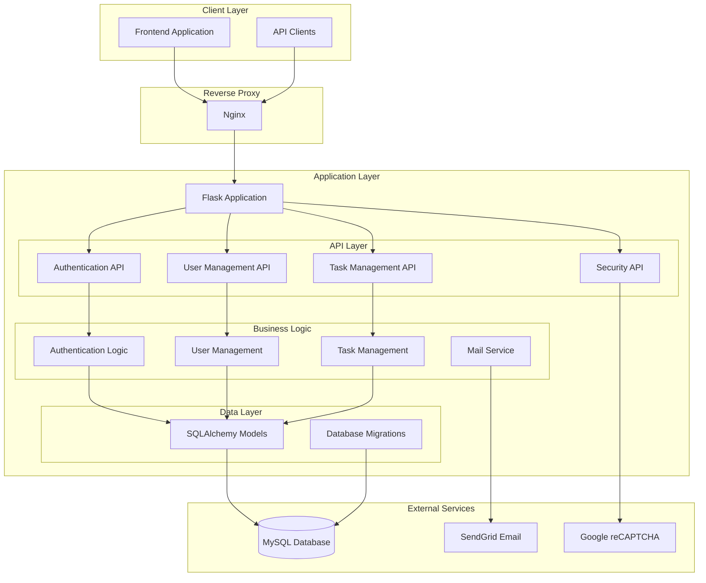

## Detailed Component Architecture

### Application Core (app.py)
Central Flask application factory and configuration:

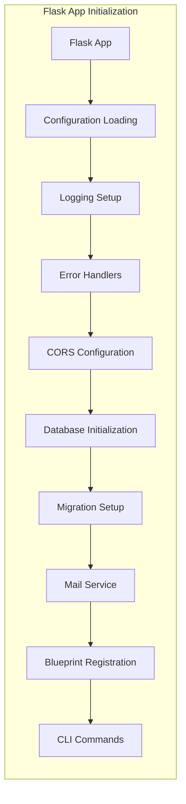

### API Layer Architecture

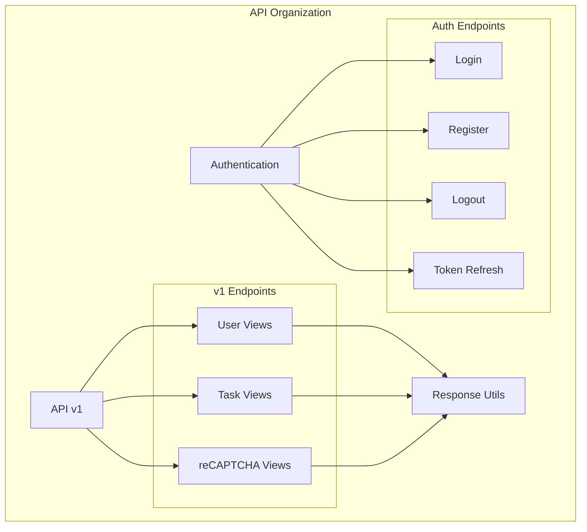

### Data Layer Architecture

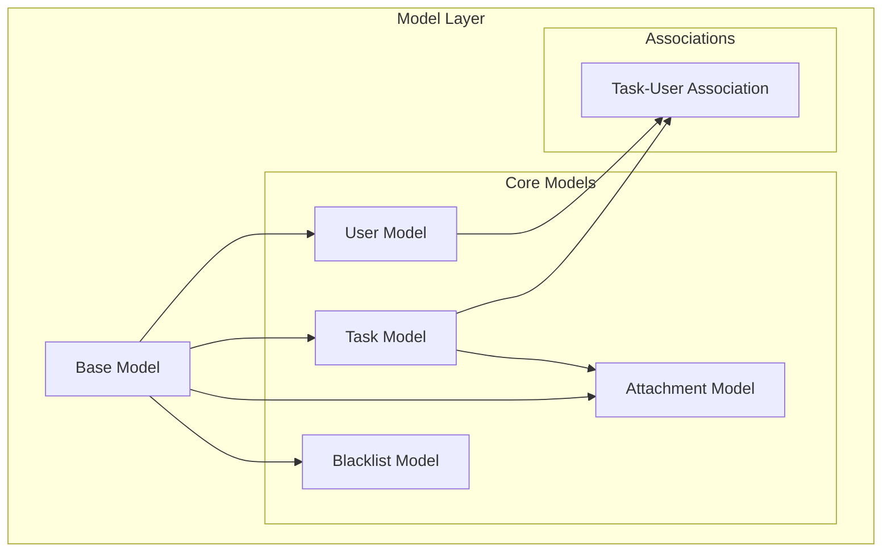

## Data Models & Relationships

### Entity Relationship Diagram

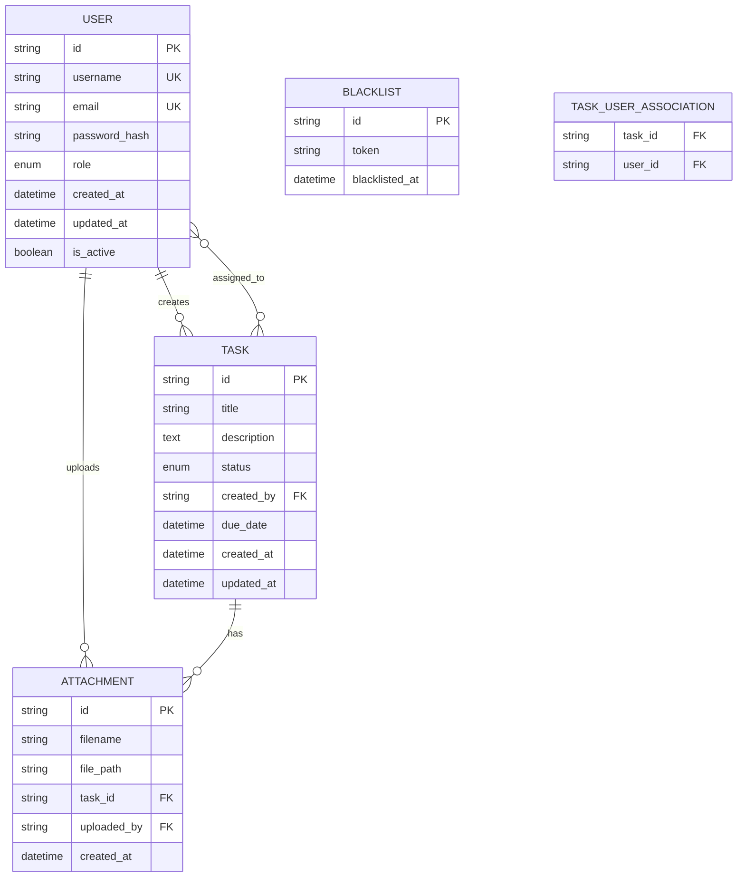

### Model Specifications

#### User Model (`models/users.py`)
- **Primary Key**: UUID string
- **Unique Constraints**: username, email
- **Role Hierarchy**: ADMIN (3) > DEVELOPER (2) > USER (1)
- **Security**: bcrypt password hashing
- **Relationships**: Many-to-many with tasks, one-to-many with created tasks

#### Task Model (`models/tasks.py`)
- **Primary Key**: UUID string
- **Status Flow**: START → PAUSE → IN_PROGRESS → DONE → CLOSE
- **Assignment**: Many-to-many relationship with users
- **Ownership**: Foreign key to creator (User)
- **Attachments**: One-to-many relationship

#### Attachment Model (`models/attachments.py`)
- **File Management**: Stores file metadata and paths
- **Relationships**: Many-to-one with Task and User
- **Security**: User-based upload tracking

## API Design

### RESTful Endpoint Structure

```mermaid
graph LR
    subgraph "API Versioning"
        ROOT[/]
        V1[/api/v1/]
        AUTH[/auth/]
    end
    
    subgraph "Resource Endpoints"
        USERS[/api/v1/users/]
        TASKS[/api/v1/tasks/]
        RECAPTCHA[/api/v1/recaptcha/]
    end
    
    subgraph "Auth Endpoints"
        LOGIN[/auth/login]
        REGISTER[/auth/register]
        LOGOUT[/auth/logout]
        REFRESH[/auth/refresh]
    end
    
    ROOT --> V1
    ROOT --> AUTH
    V1 --> USERS
    V1 --> TASKS
    V1 --> RECAPTCHA
    AUTH --> LOGIN
    AUTH --> REGISTER
    AUTH --> LOGOUT
    AUTH --> REFRESH
```

### Response Format Standard
All API responses follow a consistent format handled by `api/response_utils.py`:

```python
{
    "status": "success|error",
    "data": {...},          # Success responses
    "message": "...",       # Error messages
    "errors": [...],        # Validation errors
    "timestamp": "ISO-8601",
    "request_id": "uuid"
}
```

### HTTP Status Code Usage
- `200 OK`: Successful GET, PUT operations
- `201 Created`: Successful POST operations
- `204 No Content`: Successful DELETE operations
- `400 Bad Request`: Validation errors
- `401 Unauthorized`: Authentication required
- `403 Forbidden`: Authorization failed
- `404 Not Found`: Resource not found
- `429 Too Many Requests`: Rate limiting
- `500 Internal Server Error`: Server errors

## Security Architecture

### Authentication Flow

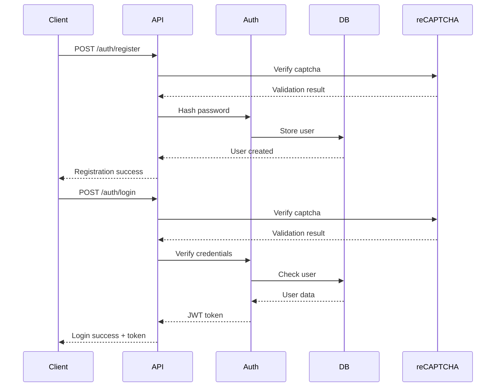

### Authorization Model

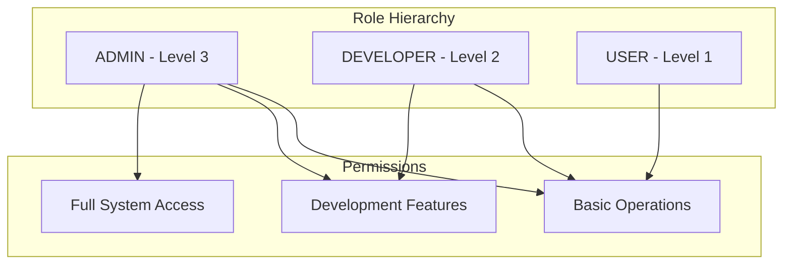

### Security Components
- **Password Security**: bcrypt with salt, configurable rounds
- **Token Management**: JWT-based authentication with blacklist support
- **Input Validation**: Custom validators and sanitization
- **CORS Configuration**: Flexible cross-origin resource sharing
- **Rate Limiting**: Configurable request throttling
- **reCAPTCHA Integration**: Google reCAPTCHA Enterprise for bot protection

## Database Architecture

### Connection Management

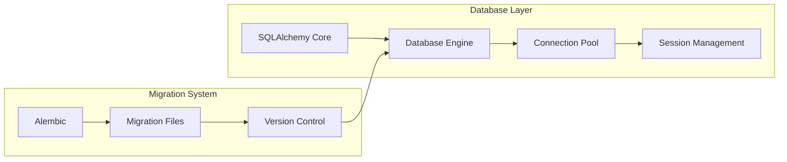

### Database Configuration
- **Primary Database**: MySQL 8.0+
- **ORM**: SQLAlchemy 3.1.1 with declarative base
- **Migrations**: Flask-Migrate with Alembic
- **Connection Pooling**: SQLAlchemy built-in pooling
- **Character Set**: utf8mb4 for full Unicode support

## Configuration Management

### Environment-Based Configuration

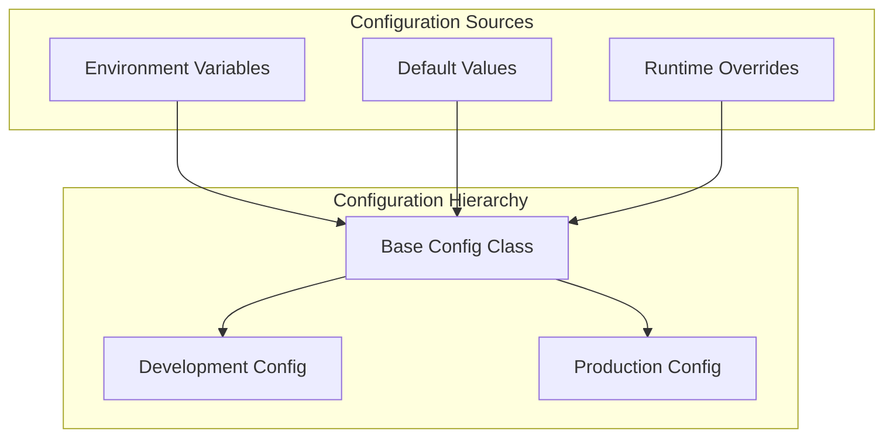

### Key Configuration Areas
- **Database**: Connection strings, pooling, timeouts
- **Security**: Secret keys, password policies, token expiration
- **Email**: SMTP configuration, templates, rate limiting
- **Logging**: Levels, handlers, rotation policies
- **External Services**: API keys, endpoints, timeouts

## Error Handling & Logging

### Error Handling Strategy

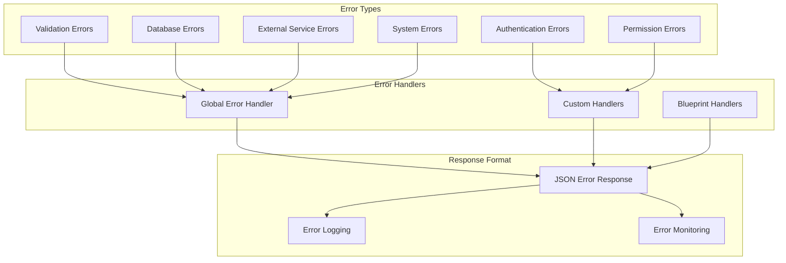

### Logging Architecture
- **Log Levels**: DEBUG, INFO, WARNING, ERROR, CRITICAL
- **Handlers**: Console, file, rotating file handlers
- **Format**: Structured logging with timestamps, request IDs
- **Rotation**: Size-based log rotation for production

## Deployment Architecture

### Container Architecture

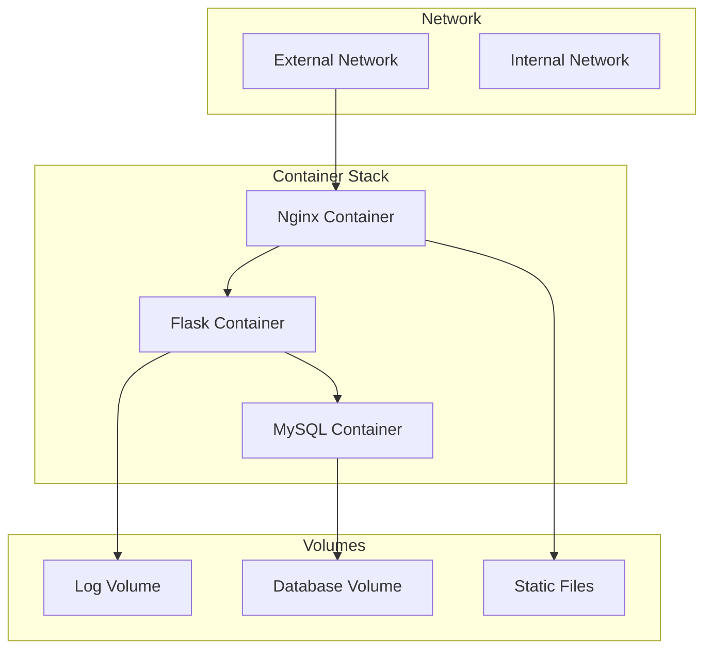

### Deployment Configuration
- **Base Image**: Python 3.10 slim
- **Exposed Ports**: 5000 (Flask), 80/443 (Nginx)
- **Environment Variables**: Database, email, security configurations
- **Health Checks**: Application and database health endpoints
- **Scaling**: Horizontal scaling with load balancer

## Design Decisions

### Architecture Decisions

| Decision | Rationale | Trade-offs |
|----------|-----------|------------|
| Flask Framework | Lightweight, flexible, extensive ecosystem | Less opinionated than Django |
| SQLAlchemy ORM | Database abstraction, relationship management | Learning curve, query complexity |
| JWT Authentication | Stateless, scalable, mobile-friendly | Token management complexity |
| Blueprint Organization | Modular code organization, version control | Initial setup complexity |
| MySQL Database | ACID compliance, performance, ecosystem | Relational constraints |

### Security Decisions

| Decision | Rationale | Implementation |
|----------|-----------|----------------|
| bcrypt Password Hashing | Industry standard, adaptive cost | 12 rounds default |
| reCAPTCHA Integration | Bot protection, spam prevention | Enterprise version |
| Role-based Access Control | Granular permissions, scalability | Hierarchical role system |
| CORS Configuration | Frontend integration, security | Configurable origins |
| Input Validation | Prevent injection attacks | Custom validators |

## Directory Structure

```
backend/
├── app.py                    # Flask application factory
├── requirements.txt          # Python dependencies
├── Dockerfile               # Container configuration
├── nginx.conf               # Reverse proxy configuration
├── api/                     # API layer
│   ├── __init__.py
│   ├── response_utils.py    # Response formatting utilities
│   ├── auth/                # Authentication endpoints
│   │   └── auth.py
│   └── v1/                  # API version 1
│       ├── task_views.py    # Task management endpoints
│       ├── user_views.py    # User management endpoints
│       └── recaptcha_views.py # Security endpoints
├── config/                  # Configuration layer
│   ├── __init__.py
│   ├── config.py           # Environment configurations
│   ├── database.py         # Database setup
│   ├── error_handlers.py   # Global error handling
│   ├── mail_service.py     # Email service configuration
│   └── recaptcha.py        # reCAPTCHA integration
├── models/                  # Data layer
│   ├── __init__.py
│   ├── base_model.py       # Base model class
│   ├── users.py            # User model and enums
│   ├── tasks.py            # Task model and associations
│   ├── attachments.py      # Attachment model
│   └── blacklist.py        # Token blacklist model
├── factories/               # Test data generation
│   ├── users.py            # User factory and CLI commands
│   └── tasks.py            # Task factory and CLI commands
├── migrations/              # Database migrations
│   └── versions/           # Migration version files
└── tests/                   # Test suite (to be implemented)
```

## Dependencies

### Core Dependencies
- **Flask 3.0.2**: Web framework and WSGI application
- **SQLAlchemy 3.1.1**: Database ORM and toolkit
- **Flask-Migrate 4.0.7**: Database migration management
- **bcrypt 4.1.2**: Password hashing and verification
- **Flask-CORS 4.0.1**: Cross-origin resource sharing

### Database & Storage
- **mysqlclient 2.2.4**: MySQL database adapter
- **Alembic 1.13.1**: Database migration tool

### Security & Validation
- **google-cloud-recaptcha-enterprise 1.20.0**: Bot protection
- **google-auth 2.29.0**: Google API authentication

### Communication
- **Flask-Mail 0.10.0**: Email sending capabilities

### Development & Testing
- **Factory Boy 3.3.0**: Test data generation
- **Faker 24.7.1**: Fake data generation
- **pytest**: Unit testing framework

### Infrastructure
- **gunicorn**: WSGI HTTP server
- **nginx**: Reverse proxy and static file serving

## References

### Technical Documentation
- [Flask Documentation](https://flask.palletsprojects.com/)
- [SQLAlchemy Documentation](https://docs.sqlalchemy.org/)
- [MySQL 8.0 Reference Manual](https://dev.mysql.com/doc/refman/8.0/en/)
- [bcrypt Documentation](https://pypi.org/project/bcrypt/)

### Security Standards
- [OWASP Web Application Security](https://owasp.org/www-project-top-ten/)
- [JWT Best Practices](https://tools.ietf.org/html/rfc7519)
- [Password Security Guidelines](https://pages.nist.gov/800-63-3/)

### External Services
- [Google reCAPTCHA Enterprise](https://cloud.google.com/recaptcha-enterprise)
- [SendGrid Email API](https://sendgrid.com/docs/api-reference/)

### Development Resources
- [Factory Boy Documentation](https://factoryboy.readthedocs.io/)
- [Flask-Migrate Documentation](https://flask-migrate.readthedocs.io/)
- [Docker Best Practices](https://docs.docker.com/develop/dev-best-practices/)

---

*This architecture document is maintained as part of the CollabHub project documentation. For updates and contributions, see [CONTRIBUTING.md](../CONTRIBUTING.md).*
