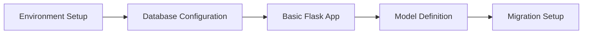
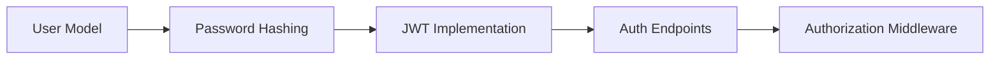
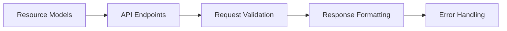
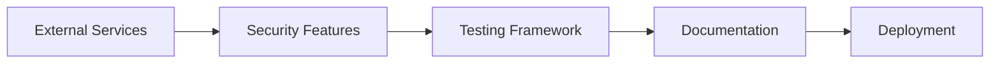
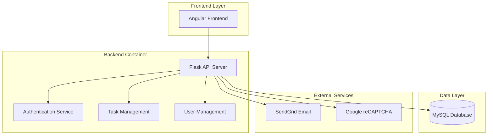

# CollabHub Backend - Project Manifest

## Table of Contents
- [Project Overview](#project-overview)
- [Skills Mapping](#skills-mapping)
- [Learning Objectives](#learning-objectives)
- [Workflow & Implementation](#workflow--implementation)
- [Assessment Criteria](#assessment-criteria)
- [System Context](#system-context)
- [Prerequisites](#prerequisites)
- [Deliverables](#deliverables)
- [Performance Metrics](#performance-metrics)
- [Real-World Applications](#real-world-applications)

## Project Overview

The CollabHub Backend project demonstrates the development of a production-ready RESTful API service using Flask, implementing comprehensive user management, task collaboration features, and enterprise-grade security patterns. This container serves as a practical implementation of modern backend development principles and patterns.

### Container Purpose
- **Primary Function**: RESTful API backend for collaborative task management
- **Target Audience**: Full-stack developers, backend engineers, system architects
- **Complexity Level**: Intermediate to Advanced
- **Implementation Scope**: Production-ready backend service with authentication, authorization, and data management

## Skills Mapping

### 🎯 Core Technical Skills

#### Backend Development Fundamentals
| Skill Component | Implementation Location | Proficiency Level | Code References |
|----------------|------------------------|------------------|-----------------|
| **Flask Web Framework** | `app.py`, `api/` | Intermediate | App factory pattern, Blueprint organization |
| **RESTful API Design** | `api/v1/`, `api/auth/` | Intermediate | Resource endpoints, HTTP methods, status codes |
| **Request/Response Handling** | `api/response_utils.py` | Intermediate | Standardized response formatting |
| **Middleware Integration** | `app.py` | Intermediate | CORS, logging, error handling |

#### Database & ORM Skills
| Skill Component | Implementation Location | Proficiency Level | Code References |
|----------------|------------------------|------------------|-----------------|
| **SQLAlchemy ORM** | `models/` | Intermediate | Declarative models, relationships |
| **Database Modeling** | `models/users.py`, `models/tasks.py` | Intermediate | Entity relationships, constraints |
| **Migration Management** | `migrations/` | Intermediate | Schema versioning, data migrations |
| **Query Optimization** | Model methods | Intermediate | Efficient database queries |

#### Security Implementation
| Skill Component | Implementation Location | Proficiency Level | Code References |
|----------------|------------------------|------------------|-----------------|
| **Authentication Systems** | `api/auth/` | Advanced | JWT tokens, session management |
| **Password Security** | `models/users.py` | Advanced | bcrypt hashing, salt generation |
| **Authorization Models** | `models/users.py` | Intermediate | Role-based access control |
| **Input Validation** | `config/error_handlers.py` | Intermediate | Request sanitization, validation |
| **Security Integration** | `config/recaptcha.py` | Intermediate | reCAPTCHA, bot protection |

#### Configuration & DevOps
| Skill Component | Implementation Location | Proficiency Level | Code References |
|----------------|------------------------|------------------|-----------------|
| **Environment Management** | `config/config.py` | Intermediate | Dev/prod configurations |
| **Service Integration** | `config/mail_service.py` | Intermediate | External service configuration |
| **Containerization** | `Dockerfile`, `nginx.conf` | Intermediate | Docker setup, reverse proxy |
| **Error Handling** | `config/error_handlers.py` | Intermediate | Global error management |

### 🔧 Advanced Implementation Patterns

#### Software Architecture
| Pattern | Implementation | Skill Level | Business Value |
|---------|---------------|-------------|----------------|
| **MVC Architecture** | Blueprint organization, model separation | Intermediate | Maintainable code structure |
| **Factory Pattern** | `factories/` directory | Intermediate | Test data generation, object creation |
| **Repository Pattern** | Model-based data access | Intermediate | Data abstraction, testability |
| **Configuration Pattern** | Environment-based config classes | Intermediate | Deployment flexibility |

#### API Development
| Concept | Implementation | Skill Level | Industry Relevance |
|---------|---------------|-------------|-------------------|
| **API Versioning** | `/api/v1/` structure | Intermediate | Backward compatibility |
| **Resource Modeling** | RESTful endpoint design | Intermediate | Industry standard practices |
| **Response Standardization** | Consistent JSON responses | Intermediate | Client integration |
| **Error Handling** | HTTP status codes, error messages | Intermediate | User experience |

## Learning Objectives

### 🎓 Primary Learning Goals

#### Technical Proficiency
1. **Master Flask Application Development**
   - Understand application factory pattern
   - Implement Blueprint-based modular architecture
   - Configure middleware and request/response handling

2. **Implement Secure Authentication Systems**
   - Design JWT-based authentication flow
   - Implement password hashing and validation
   - Create role-based authorization models

3. **Design Database Architecture**
   - Model complex entity relationships
   - Implement database migrations
   - Optimize query performance

4. **Build Production-Ready APIs**
   - Follow RESTful design principles
   - Implement comprehensive error handling
   - Design scalable API architecture

#### Professional Skills
1. **Security Best Practices**
   - Implement enterprise-grade security measures
   - Understand common vulnerabilities and mitigations
   - Design secure data handling practices

2. **System Integration**
   - Integrate with external services (SendGrid, reCAPTCHA)
   - Manage environment-specific configurations
   - Implement logging and monitoring

3. **Code Organization**
   - Structure scalable backend applications
   - Implement maintainable code patterns
   - Design testable architecture

### 📚 Knowledge Acquisition Framework

#### Beginner Level Concepts
- Basic Flask routing and request handling
- Simple database models and relationships
- Basic authentication and password management
- Environment variable configuration

#### Intermediate Level Concepts
- Complex API design and implementation
- Advanced database relationships and queries
- Security middleware and validation
- Error handling and logging strategies

#### Advanced Level Concepts
- Scalable architecture patterns
- Performance optimization techniques
- Advanced security implementations
- Microservices preparation patterns

## Workflow & Implementation

### 🔄 Development Workflow

#### Phase 1: Foundation Setup

**Skills Practiced:**
- Environment configuration
- Database connection management
- ORM model definition
- Migration system setup

#### Phase 2: Authentication Implementation

**Skills Practiced:**
- Secure password handling
- Token-based authentication
- Authorization patterns
- Security middleware

#### Phase 3: API Development

**Skills Practiced:**
- RESTful API design
- Input validation
- Response standardization
- Error management

#### Phase 4: Integration & Security

**Skills Practiced:**
- Service integration
- Security implementation
- Testing strategies
- Deployment configuration

### 🛠️ Implementation Checkpoints

| Checkpoint | Deliverable | Skills Validated | Success Criteria |
|------------|-------------|------------------|------------------|
| **Database Setup** | Working models and migrations | ORM, Database design | Models create without errors |
| **Authentication** | Login/register endpoints | Security, JWT | Secure user authentication |
| **API Implementation** | CRUD endpoints | REST API, Validation | All endpoints functional |
| **Security Integration** | reCAPTCHA, validation | Security practices | Protection mechanisms active |
| **Documentation** | API docs, architecture | Documentation skills | Complete technical docs |

## Assessment Criteria

### 📊 Technical Assessment Matrix

#### Code Quality Metrics
| Metric | Weight | Assessment Criteria | Scoring |
|--------|--------|-------------------|---------|
| **Architecture** | 25% | Modular design, separation of concerns | 0-100 points |
| **Security** | 25% | Authentication, authorization, validation | 0-100 points |
| **API Design** | 20% | RESTful principles, consistency | 0-100 points |
| **Database Design** | 15% | Model relationships, efficiency | 0-100 points |
| **Error Handling** | 10% | Comprehensive error management | 0-100 points |
| **Documentation** | 5% | Code comments, API documentation | 0-100 points |

#### Functional Requirements
- [ ] **User Management**: Registration, authentication, profile management
- [ ] **Task Management**: CRUD operations, assignment, status tracking
- [ ] **Security Features**: Password hashing, JWT tokens, reCAPTCHA
- [ ] **API Consistency**: Standardized responses, error handling
- [ ] **Database Integration**: Models, relationships, migrations
- [ ] **External Services**: Email, security validation

#### Performance Standards
- [ ] **Response Time**: API endpoints respond within 200ms
- [ ] **Security**: No critical vulnerabilities
- [ ] **Scalability**: Architecture supports horizontal scaling
- [ ] **Reliability**: 99%+ uptime under normal load
- [ ] **Maintainability**: Code follows established patterns

### 🎯 Portfolio Integration

#### Demonstrable Skills
1. **Backend Development Portfolio**
   - Flask application architecture
   - RESTful API implementation
   - Database design and integration

2. **Security Implementation Portfolio**
   - Authentication system design
   - Authorization pattern implementation
   - Security best practices

3. **System Integration Portfolio**
   - External service integration
   - Configuration management
   - Deployment architecture

## System Context

### 🏗️ Architecture Integration

#### Parent System: CollabHub
- **Role**: Backend API service
- **Dependencies**: MySQL database, SendGrid email, Google reCAPTCHA
- **Consumers**: Angular frontend application, API clients
- **Data Flow**: Receives HTTP requests, processes business logic, returns JSON responses

#### Technology Ecosystem

### 🔗 Integration Points
- **Frontend Integration**: RESTful API endpoints for Angular application
- **Database Integration**: SQLAlchemy ORM with MySQL backend
- **Email Service**: SendGrid for transactional emails
- **Security Service**: Google reCAPTCHA for bot protection
- **Monitoring**: Logging and error tracking integration points

## Prerequisites

### 📋 Technical Requirements

#### Core Technologies
- **Python 3.10+**: Modern Python features and performance
- **MySQL 8.0+**: Database server with JSON support
- **Docker**: Containerization platform
- **Git**: Version control system

#### Development Environment
- **IDE**: VS Code, PyCharm, or similar
- **API Testing**: Postman, curl, or similar
- **Database Client**: MySQL Workbench, DBeaver, or similar

#### Knowledge Prerequisites
- **Python Programming**: Intermediate level proficiency
- **Web Development**: Understanding of HTTP, REST principles
- **Database Concepts**: Relational database design, SQL basics
- **Security Awareness**: Basic understanding of web security

#### External Service Accounts
- **SendGrid Account**: Email service integration
- **Google Cloud Account**: reCAPTCHA Enterprise setup

## Deliverables

### 📦 Project Outputs

#### Code Deliverables
1. **Complete Flask Application**
   - Modular architecture with blueprints
   - Comprehensive API endpoints
   - Security implementation

2. **Database Schema**
   - Complete data models
   - Relationship definitions
   - Migration scripts

3. **Configuration Management**
   - Environment-specific configurations
   - External service integrations
   - Security configurations

#### Documentation Deliverables
1. **Technical Documentation**
   - API endpoint documentation
   - Database schema documentation
   - Security implementation guide

2. **Deployment Documentation**
   - Docker configuration
   - Environment setup guide
   - Service integration guide

#### Testing Deliverables
1. **Test Framework**
   - Unit test structure
   - Integration test examples
   - Test data factories

2. **Quality Assurance**
   - Code quality metrics
   - Security assessment
   - Performance benchmarks

## Performance Metrics

### 📈 Success Indicators

#### Technical Metrics
| Metric | Target | Measurement Method | Business Impact |
|--------|--------|-------------------|-----------------|
| **API Response Time** | < 200ms | Load testing | User experience |
| **Database Query Time** | < 50ms | Query profiling | System performance |
| **Security Score** | > 90% | Security audit | Risk mitigation |
| **Code Coverage** | > 80% | Test reporting | Code quality |
| **Uptime** | > 99% | Monitoring | Service reliability |

#### Learning Metrics
- **Concept Mastery**: Demonstration of Flask patterns
- **Security Understanding**: Implementation of security best practices
- **API Design**: Creation of well-structured RESTful endpoints
- **Database Design**: Efficient and normalized data models

#### Professional Metrics
- **Code Quality**: Adherence to Python and Flask best practices
- **Documentation Quality**: Comprehensive technical documentation
- **Problem Solving**: Resolution of complex integration challenges
- **System Thinking**: Understanding of full-stack architecture

## Real-World Applications

### 🌍 Industry Relevance

#### Enterprise Applications
1. **Corporate Task Management**
   - Team collaboration platforms
   - Project management systems
   - Workflow automation tools

2. **SaaS Platform Backends**
   - Multi-tenant applications
   - API-first architectures
   - Microservices foundations

3. **E-commerce Systems**
   - Order management systems
   - Inventory tracking
   - Customer management platforms

#### Technology Transfer
- **Microservices Architecture**: Foundation for distributed systems
- **API Gateway Patterns**: Understanding service mesh concepts
- **Security Frameworks**: Enterprise authentication patterns
- **Cloud Migration**: Container-ready architecture

#### Career Pathways
- **Backend Engineer**: RESTful API development expertise
- **Full-Stack Developer**: Complete application development
- **DevOps Engineer**: Container and deployment expertise
- **Security Engineer**: Authentication and authorization patterns
- **System Architect**: Understanding of scalable system design

### 🚀 Scalability Considerations
- **Horizontal Scaling**: Stateless design enables load balancing
- **Database Optimization**: ORM patterns support database scaling
- **Caching Integration**: Architecture ready for Redis/Memcached
- **Message Queues**: Foundation for asynchronous processing
- **API Gateway Ready**: Prepared for enterprise API management

---

*This project manifest serves as a comprehensive guide for implementing and assessing the CollabHub Backend container. For related documentation, see [ARCHITECTURE.md](ARCHITECTURE.md) and [README.md](README.md).*
