# CollabHub Frontend Architecture

[](https://angular.io/)
[](https://www.typescriptlang.org/)
[](https://tailwindcss.com/)
[](https://rxjs.dev/)

## Table of Contents
- [Overview](#overview)
- [High-Level Architecture](#high-level-architecture)
- [Component Architecture](#component-architecture)
- [Module Organization](#module-organization)
- [Data Flow & State Management](#data-flow--state-management)
- [Routing Architecture](#routing-architecture)
- [Security Architecture](#security-architecture)
- [UI/UX Architecture](#uiux-architecture)
- [API Integration](#api-integration)
- [Performance Architecture](#performance-architecture)
- [Build & Deployment](#build--deployment)
- [Design Decisions](#design-decisions)
- [Directory Structure](#directory-structure)
- [Dependencies](#dependencies)
- [References](#references)

## Overview

The CollabHub Frontend is a modern Single Page Application (SPA) built with Angular 17, featuring standalone components, reactive programming patterns, and a modular architecture. The application provides a comprehensive user interface for collaborative task management with emphasis on user experience, security, and maintainability.

### Core Principles
- **Component-Based Architecture**: Standalone components with clear separation of concerns
- **Reactive Programming**: RxJS-based data flow and state management
- **Type Safety**: Comprehensive TypeScript integration with strict type checking
- **Mobile-First Design**: Responsive UI with TailwindCSS utility framework
- **Security-First**: Authentication, authorization, and input validation throughout

## High-Level Architecture

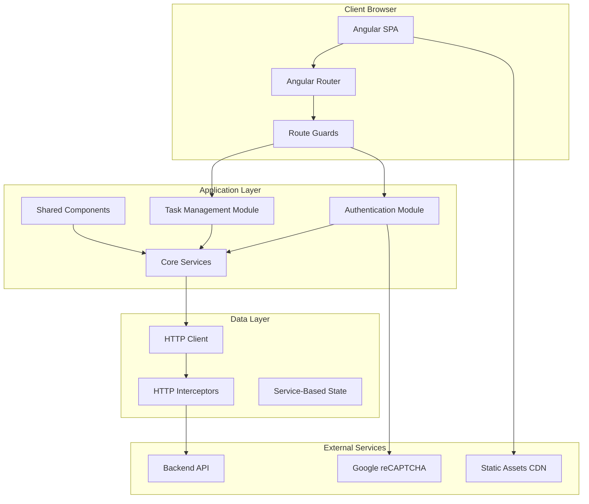

## Component Architecture

### Application Structure

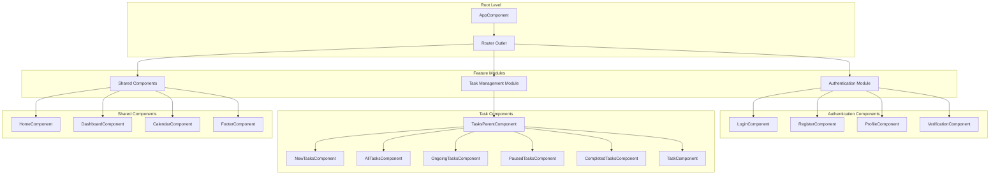

### Component Communication Patterns

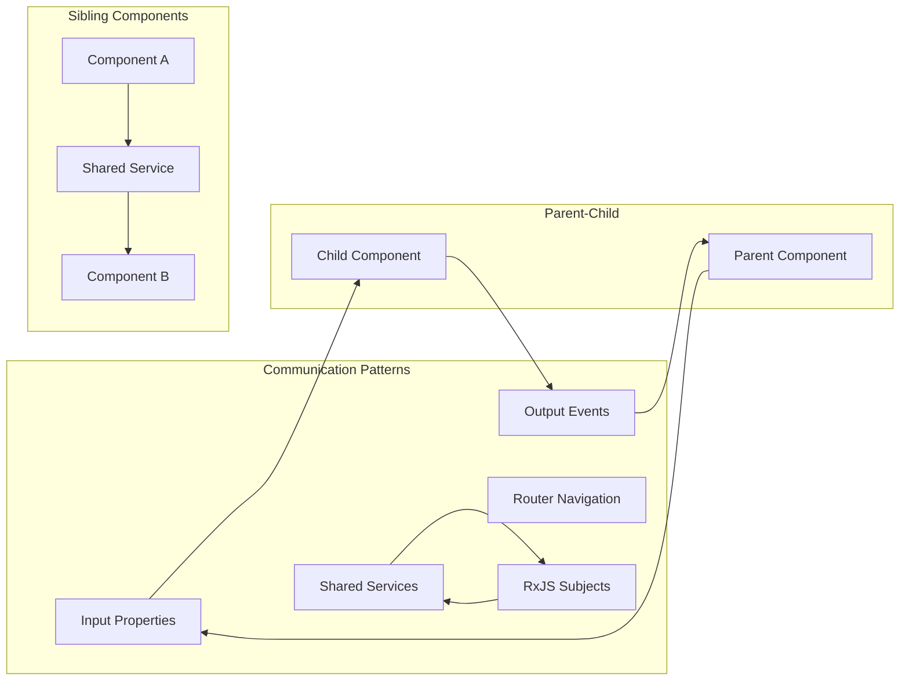

## Module Organization

### Feature-Based Architecture

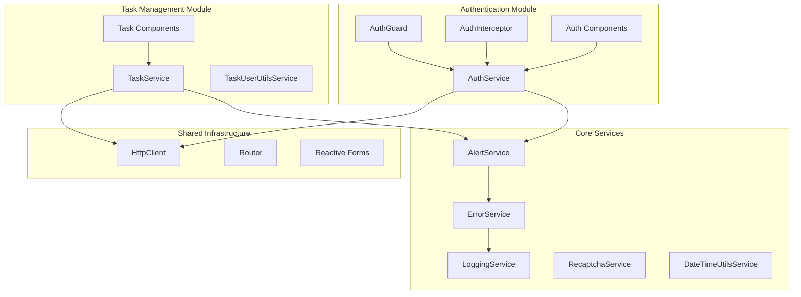

### Standalone Component Strategy

```typescript
// Example standalone component structure
@Component({
  selector: 'app-login',
  standalone: true,
  imports: [
    ReactiveFormsModule,
    RouterModule,
    CommonModule
  ],
  templateUrl: './login.component.html',
  styleUrl: './login.component.css'
})
export class LoginComponent {
  // Component implementation
}
```

## Data Flow & State Management

### Service-Based State Management

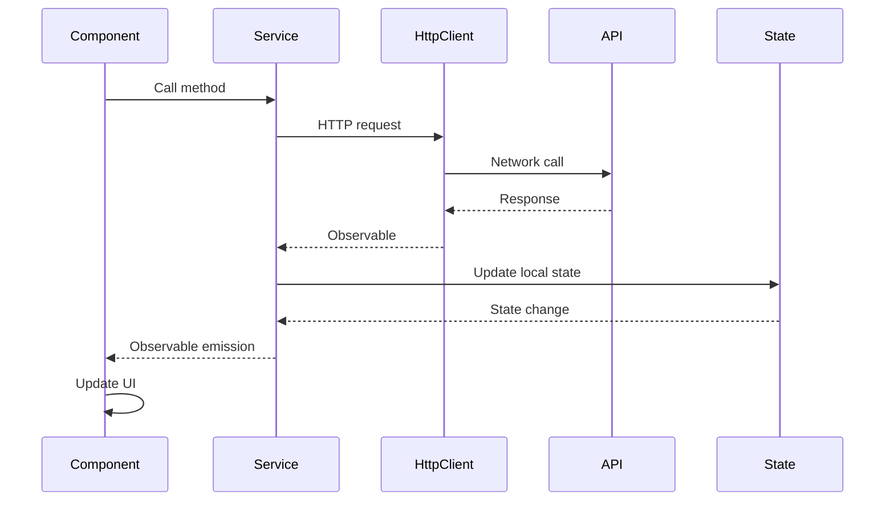

### Reactive Data Flow

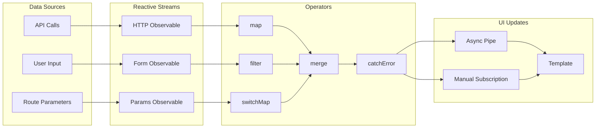

### State Management Patterns

```typescript
// Example service state management
@Injectable({
  providedIn: 'root'
})
export class TaskService {
  private tasksSubject = new BehaviorSubject<Task[]>([]);
  public tasks$ = this.tasksSubject.asObservable();
  
  private loadingSubject = new BehaviorSubject<boolean>(false);
  public loading$ = this.loadingSubject.asObservable();
  
  // State update methods
  updateTasks(tasks: Task[]): void {
    this.tasksSubject.next(tasks);
  }
  
  setLoading(loading: boolean): void {
    this.loadingSubject.next(loading);
  }
}
```

## Routing Architecture

### Route Configuration

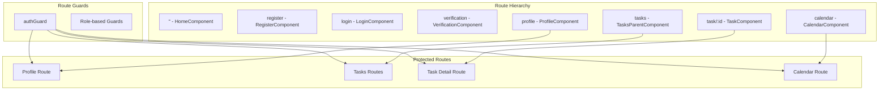

### Nested Routing Structure

```typescript
// Route configuration example
export const routes: Routes = [
  { path: '', component: HomeComponent, title: 'Hero' },
  { path: 'register', component: RegisterComponent, title: 'join' },
  { path: 'login', component: LoginComponent, title: 'login' },
  { path: 'verification', component: VerificationComponent, title: 'verification' },
  { 
    path: 'profile', 
    component: ProfileComponent, 
    title: 'profile', 
    canActivate: [authGuard] 
  },
  {
    path: 'tasks',
    component: TasksParentComponent,
    canActivate: [authGuard],
    children: [
      { path: '', component: AllTasksComponent },
      { path: 'new', component: NewTasksComponent },
      { path: 'ongoing', component: OngoingTasksComponent },
      { path: 'paused', component: PausedTasksComponent },
      { path: 'completed', component: CompletedTasksComponent }
    ]
  },
  { 
    path: 'task/:taskId', 
    component: TaskComponent, 
    title: 'task', 
    canActivate: [authGuard] 
  },
  { 
    path: 'calendar', 
    component: CalendarComponent, 
    title: 'calendar', 
    canActivate: [authGuard] 
  }
];
```

## Security Architecture

### Authentication Flow

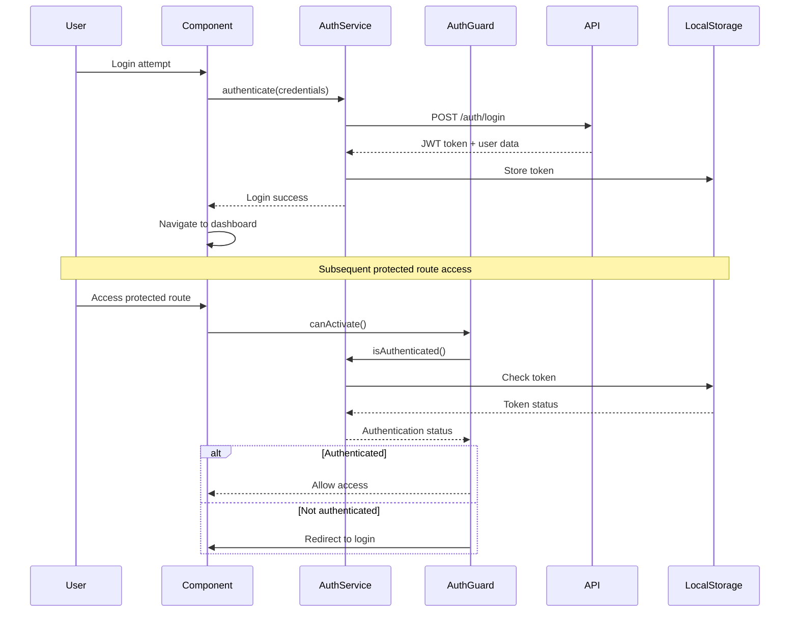

### Security Implementation Layers

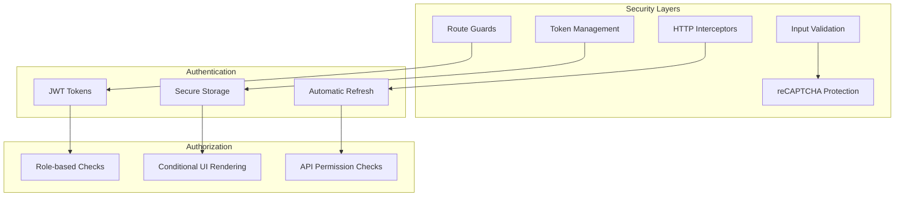

### Security Components

```typescript
// AuthGuard implementation
@Injectable({
  providedIn: 'root'
})
export class AuthGuard implements CanActivate {
  constructor(
    private authService: AuthService,
    private router: Router
  ) {}
  
  canActivate(): Observable<boolean> {
    return this.authService.isAuthenticated().pipe(
      map(isAuth => {
        if (isAuth) {
          return true;
        } else {
          this.router.navigate(['/login']);
          return false;
        }
      })
    );
  }
}

// HTTP Interceptor for authentication
@Injectable()
export class AuthInterceptor implements HttpInterceptor {
  intercept(req: HttpRequest<any>, next: HttpHandler): Observable<HttpEvent<any>> {
    const token = this.authService.getToken();
    
    if (token) {
      req = req.clone({
        setHeaders: {
          Authorization: `Bearer ${token}`
        }
      });
    }
    
    return next.handle(req);
  }
}
```

## UI/UX Architecture

### Design System Implementation

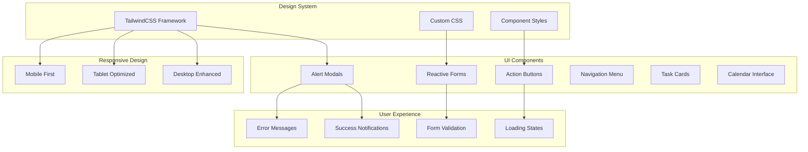

### Responsive Breakpoints

```typescript
// TailwindCSS configuration
module.exports = {
  theme: {
    screens: {
      'sm': '640px',   // Mobile landscape
      'md': '768px',   // Tablet portrait
      'lg': '1024px',  // Tablet landscape / Small desktop
      'xl': '1280px',  // Desktop
      '2xl': '1536px'  // Large desktop
    }
  }
}
```

### Component Styling Strategy

```css
/* Global styles - styles.css */
@tailwind base;
@tailwind components;
@tailwind utilities;

/* Custom component utilities */
@layer components {
  .btn-primary {
    @apply bg-blue-500 hover:bg-blue-700 text-white font-bold py-2 px-4 rounded;
  }
  
  .card {
    @apply bg-white shadow-md rounded-lg p-6 border border-gray-200;
  }
  
  .form-input {
    @apply border border-gray-300 rounded-md px-3 py-2 focus:outline-none focus:ring-2 focus:ring-blue-500;
  }
}
```

## API Integration

### HTTP Client Architecture

```mermaid
graph TB
    subgraph "HTTP Layer"
        HTTP_CLIENT[Angular HttpClient]
        INTERCEPTORS[HTTP Interceptors]
        ERROR_HANDLER[Global Error Handler]
    end
    
    subgraph "Service Layer"
        AUTH_SERVICE[AuthService]
        TASK_SERVICE[TaskService]
        USER_SERVICE[UserService]
        RECAPTCHA_SERVICE[RecaptchaService]
    end
    
    subgraph "Backend API"
        AUTH_ENDPOINTS[/auth/*]
        TASK_ENDPOINTS[/api/v1/tasks/*]
        USER_ENDPOINTS[/api/v1/users/*]
        SECURITY_ENDPOINTS[/api/v1/recaptcha/*]
    end
    
    subgraph "Data Models"
        USER_MODEL[User Interface]
        TASK_MODEL[Task Interface]
        RESPONSE_MODEL[API Response Interface]
    end
    
    HTTP_CLIENT --> INTERCEPTORS
    INTERCEPTORS --> ERROR_HANDLER
    
    AUTH_SERVICE --> HTTP_CLIENT
    TASK_SERVICE --> HTTP_CLIENT
    USER_SERVICE --> HTTP_CLIENT
    RECAPTCHA_SERVICE --> HTTP_CLIENT
    
    AUTH_SERVICE --> AUTH_ENDPOINTS
    TASK_SERVICE --> TASK_ENDPOINTS
    USER_SERVICE --> USER_ENDPOINTS
    RECAPTCHA_SERVICE --> SECURITY_ENDPOINTS
    
    AUTH_SERVICE --> USER_MODEL
    TASK_SERVICE --> TASK_MODEL
    AUTH_SERVICE --> RESPONSE_MODEL
    TASK_SERVICE --> RESPONSE_MODEL
```

### API Service Implementation

```typescript
// Example API service
@Injectable({
  providedIn: 'root'
})
export class TaskService {
  private apiUrl = environment.apiUrl;
  
  constructor(private http: HttpClient) {}
  
  // Get all tasks
  getTasks(): Observable<Task[]> {
    return this.http.get<ApiResponse<Task[]>>(`${this.apiUrl}/api/v1/tasks`)
      .pipe(
        map(response => response.data),
        catchError(this.handleError)
      );
  }
  
  // Create new task
  createTask(task: Partial<Task>): Observable<Task> {
    return this.http.post<ApiResponse<Task>>(`${this.apiUrl}/api/v1/tasks`, task)
      .pipe(
        map(response => response.data),
        catchError(this.handleError)
      );
  }
  
  private handleError(error: HttpErrorResponse): Observable<never> {
    console.error('API Error:', error);
    return throwError(() => error);
  }
}
```

## Performance Architecture

### Build Optimization

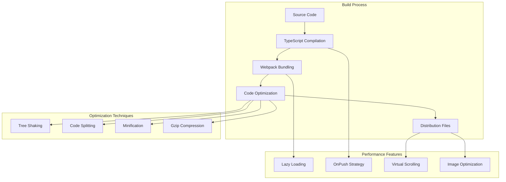

### Runtime Performance

```typescript
// OnPush change detection strategy
@Component({
  selector: 'app-task-list',
  standalone: true,
  changeDetection: ChangeDetectionStrategy.OnPush,
  template: `
    <div *ngFor="let task of tasks$ | async; trackBy: trackByTask">
      {{ task.title }}
    </div>
  `
})
export class TaskListComponent {
  tasks$ = this.taskService.tasks$;
  
  // TrackBy function for performance
  trackByTask(index: number, task: Task): string {
    return task.id;
  }
}
```

## Build & Deployment

### Build Pipeline

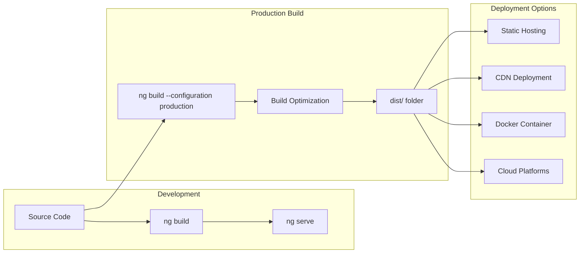

### Environment Configuration

```typescript
// Environment configuration
export const environment = {
  production: false,
  apiUrl: 'http://localhost:5000',
  recaptchaSiteKey: 'your-recaptcha-site-key',
  enableLogging: true,
  version: '0.0.0'
};
```

## Design Decisions

### Architecture Decisions

| Decision | Rationale | Trade-offs |
|----------|-----------|------------|
| **Standalone Components** | Modern Angular pattern, better tree-shaking | Initial setup complexity |
| **Service-Based State** | Simple, predictable state management | Less sophisticated than NgRx |
| **TailwindCSS** | Utility-first, rapid development | Learning curve, larger CSS |
| **Reactive Forms** | Type safety, validation control | More complex than template forms |
| **RxJS Observables** | Reactive programming, async handling | Learning curve, memory leaks if not handled |

### Technology Decisions

| Decision | Rationale | Implementation |
|----------|-----------|----------------|
| **Angular 17** | Latest features, performance improvements | Standalone components, signals preparation |
| **TypeScript 5.4** | Type safety, modern JavaScript features | Strict type checking enabled |
| **Angular Calendar** | Mature library, feature-rich | Integration with task due dates |
| **SweetAlert2** | Better UX than native alerts | Custom styling, promise-based |
| **date-fns** | Lightweight alternative to moment.js | Tree-shakable, immutable |

## Directory Structure

```
frontend/
├── src/
│   ├── app/
│   │   ├── Auth/                        # Authentication module
│   │   │   ├── login/                   # Login component
│   │   │   │   ├── login.component.ts
│   │   │   │   ├── login.component.html
│   │   │   │   └── login.component.css
│   │   │   ├── register/                # Registration component
│   │   │   ├── profile/                 # User profile component
│   │   │   ├── verification/            # Email verification
│   │   │   ├── auth.service.ts          # Authentication service
│   │   │   ├── auth.guard.ts            # Route protection guard
│   │   │   └── auth.interceptor.ts      # HTTP authentication interceptor
│   │   ├── Task/                        # Task management module
│   │   │   ├── new-tasks/               # Create new tasks
│   │   │   ├── all-tasks/               # All tasks view
│   │   │   ├── ongoing-tasks/           # Active tasks
│   │   │   ├── paused-tasks/            # Paused tasks
│   │   │   ├── completed-tasks/         # Completed tasks
│   │   │   ├── task/                    # Individual task view
│   │   │   ├── tasks-parent/            # Task container component
│   │   │   ├── task.service.ts          # Task API service
│   │   │   └── task-user-utils.service.ts # Task utilities
│   │   ├── calendar/                    # Calendar component
│   │   │   ├── calendar.component.ts
│   │   │   ├── calendar.component.html
│   │   │   └── calendar.component.css
│   │   ├── dashboard/                   # Main dashboard
│   │   ├── home/                        # Landing page
│   │   ├── footer/                      # Footer component
│   │   ├── app.component.ts             # Root component
│   │   ├── app.component.html           # Root template
│   │   ├── app.component.css            # Root styles
│   │   ├── app.routes.ts                # Application routing
│   │   ├── app.config.ts                # Application configuration
│   │   ├── alert.service.ts             # Notification service
│   │   ├── logging.service.ts           # Logging service
│   │   ├── error.service.ts             # Error handling service
│   │   ├── recaptcha.service.ts         # reCAPTCHA service
│   │   └── date-time-utils.service.ts   # Date utility service
│   ├── assets/                          # Static assets
│   │   ├── images/                      # Image files
│   │   └── icons/                       # Icon files
│   ├── environments/                    # Environment configurations
│   │   ├── environment.ts               # Development environment
│   │   └── environment.prod.ts          # Production environment
│   ├── index.html                       # Main HTML file
│   ├── main.ts                          # Application bootstrap
│   └── styles.css                       # Global styles
├── angular.json                         # Angular CLI configuration
├── package.json                         # NPM dependencies and scripts
├── tailwind.config.js                   # TailwindCSS configuration
├── tsconfig.json                        # TypeScript configuration
├── tsconfig.app.json                    # App-specific TypeScript config
└── tsconfig.spec.json                   # Test-specific TypeScript config
```

## Dependencies

### Core Dependencies
- **@angular/core 17.3.0**: Angular framework core
- **@angular/router 17.3.0**: Angular routing module
- **@angular/forms 17.3.0**: Reactive and template-driven forms
- **@angular/common 17.3.0**: Common Angular directives and pipes
- **rxjs 7.8.0**: Reactive Extensions for JavaScript

### UI/UX Dependencies
- **tailwindcss 3.4.3**: Utility-first CSS framework
- **angular-calendar 0.31.1**: Calendar component library
- **sweetalert2 11.10.8**: Beautiful alert dialogs
- **date-fns 3.6.0**: Modern JavaScript date utility library

### Security Dependencies
- **ng-recaptcha 13.2.1**: Google reCAPTCHA integration

### Development Dependencies
- **@angular/cli 17.3.5**: Angular development tools
- **typescript 5.4.2**: TypeScript compiler
- **karma 6.4.0**: Test runner
- **jasmine 5.1.0**: Testing framework

### Build Dependencies
- **@angular-devkit/build-angular 17.3.5**: Angular build system
- **autoprefixer 10.4.19**: CSS vendor prefix automation
- **postcss 8.4.38**: CSS transformation tool

## References

### Angular Documentation
- [Angular Framework](https://angular.io/)
- [Angular Router](https://angular.io/guide/router)
- [Reactive Forms](https://angular.io/guide/reactive-forms)
- [Angular CLI](https://angular.io/cli)

### Third-Party Libraries
- [TailwindCSS Documentation](https://tailwindcss.com/docs)
- [RxJS Documentation](https://rxjs.dev/)
- [Angular Calendar](https://mattlewis92.github.io/angular-calendar/)
- [SweetAlert2](https://sweetalert2.github.io/)

### TypeScript Resources
- [TypeScript Handbook](https://www.typescriptlang.org/docs/)
- [TypeScript Style Guide](https://google.github.io/styleguide/tsguide.html)

### Development Resources
- [Angular Style Guide](https://angular.io/guide/styleguide)
- [Angular Architecture Guide](https://angular.io/guide/architecture)
- [Angular Security Guide](https://angular.io/guide/security)

---

*This architecture document provides comprehensive technical details of the CollabHub Frontend application design and implementation patterns.*
