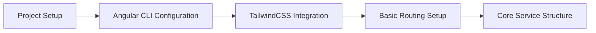
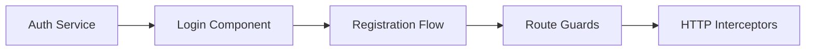
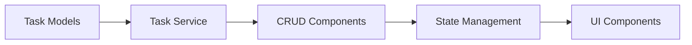
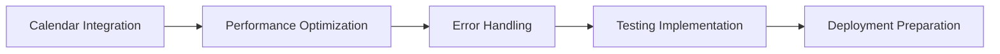
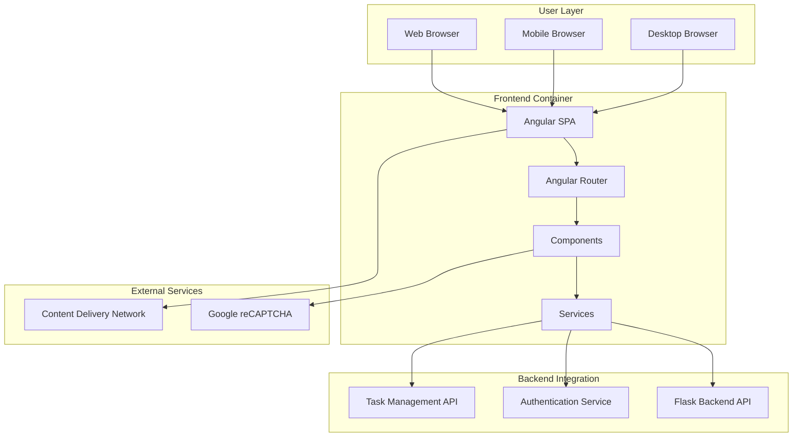

# CollabHub Frontend - Project Manifest

## Table of Contents
- [Project Overview](#project-overview)
- [Skills Mapping](#skills-mapping)
- [Learning Objectives](#learning-objectives)
- [Workflow & Implementation](#workflow--implementation)
- [Assessment Criteria](#assessment-criteria)
- [System Context](#system-context)
- [Prerequisites](#prerequisites)
- [Deliverables](#deliverables)
- [Performance Metrics](#performance-metrics)
- [Real-World Applications](#real-world-applications)

## Project Overview

The CollabHub Frontend project demonstrates modern Angular 17 development with TypeScript, showcasing Single Page Application (SPA) architecture, reactive programming patterns, and comprehensive UI/UX implementation. This container serves as a practical implementation of contemporary frontend development practices and patterns.

### Container Purpose
- **Primary Function**: Modern Angular SPA for collaborative task management
- **Target Audience**: Frontend developers, full-stack engineers, UI/UX developers
- **Complexity Level**: Intermediate to Advanced
- **Implementation Scope**: Production-ready frontend application with authentication, responsive design, and real-time features

## Skills Mapping

### 🎯 Core Technical Skills

#### Angular Framework Mastery
| Skill Component | Implementation Location | Proficiency Level | Code References |
|----------------|------------------------|------------------|-----------------|
| **Standalone Components** | `src/app/` components | Intermediate | Modern component architecture without NgModules |
| **Angular Router** | `app.routes.ts`, guards | Intermediate | Route configuration, lazy loading, guards |
| **Reactive Forms** | Auth and Task forms | Intermediate | FormBuilder, validators, reactive patterns |
| **Dependency Injection** | Services throughout app | Intermediate | Injectable services, provider configuration |
| **Change Detection** | Component optimization | Intermediate | OnPush strategy, performance optimization |

#### TypeScript Programming
| Skill Component | Implementation Location | Proficiency Level | Code References |
|----------------|------------------------|------------------|-----------------|
| **Type Definitions** | `*.ts` files, interfaces | Intermediate | Custom interfaces, type safety |
| **Generics & Advanced Types** | Services, models | Intermediate | Generic services, union types |
| **Decorators** | Components, services | Intermediate | @Component, @Injectable, custom decorators |
| **ES6+ Features** | Throughout codebase | Intermediate | Async/await, destructuring, arrow functions |

#### Reactive Programming with RxJS
| Skill Component | Implementation Location | Proficiency Level | Code References |
|----------------|------------------------|------------------|-----------------|
| **Observables & Subjects** | Services, components | Intermediate | BehaviorSubject, async data streams |
| **RxJS Operators** | HTTP calls, data transformation | Intermediate | map, filter, switchMap, catchError |
| **Error Handling** | Service error management | Intermediate | Robust error streams and recovery |
| **Memory Management** | Component lifecycle | Intermediate | Subscription management, takeUntil patterns |

#### Modern CSS & UI Development
| Skill Component | Implementation Location | Proficiency Level | Code References |
|----------------|------------------------|------------------|-----------------|
| **TailwindCSS Framework** | `tailwind.config.js`, templates | Intermediate | Utility-first CSS, responsive design |
| **Responsive Design** | Component templates | Intermediate | Mobile-first approach, breakpoint management |
| **Component Styling** | Component CSS files | Intermediate | Scoped styles, CSS architecture |
| **Animation & Transitions** | UI interactions | Beginner | CSS transitions, Angular animations |

### 🔧 Advanced Implementation Patterns

#### SPA Architecture
| Pattern | Implementation | Skill Level | Business Value |
|---------|---------------|-------------|----------------|
| **Client-Side Routing** | Angular Router with guards | Intermediate | Seamless user navigation |
| **State Management** | Service-based with RxJS | Intermediate | Predictable application state |
| **HTTP Interceptors** | Authentication, error handling | Intermediate | Centralized request/response processing |
| **Guard Patterns** | Route protection, authorization | Intermediate | Security and access control |

#### Security Implementation
| Concept | Implementation | Skill Level | Industry Relevance |
|---------|---------------|-------------|-------------------|
| **JWT Authentication** | Token-based auth system | Intermediate | Modern authentication standard |
| **Route Protection** | AuthGuard implementation | Intermediate | Secure application access |
| **Input Validation** | Reactive form validation | Intermediate | Data integrity and security |
| **XSS Prevention** | Angular sanitization | Intermediate | Web security best practices |

## Learning Objectives

### 🎓 Primary Learning Goals

#### Technical Proficiency
1. **Master Modern Angular Development**
   - Implement standalone component architecture
   - Configure advanced routing with guards and lazy loading
   - Build reactive forms with comprehensive validation
   - Optimize performance with change detection strategies

2. **Develop Reactive Programming Skills**
   - Design observable-based data flows
   - Implement complex RxJS operator chains
   - Handle asynchronous operations effectively
   - Manage application state with reactive patterns

3. **Create Professional User Interfaces**
   - Build responsive layouts with TailwindCSS
   - Implement modern UI/UX patterns
   - Optimize for mobile and desktop experiences
   - Create accessible and inclusive interfaces

4. **Implement Security Best Practices**
   - Design secure authentication flows
   - Implement authorization and access control
   - Validate and sanitize user inputs
   - Handle security tokens and session management

#### Professional Skills
1. **Frontend Architecture Design**
   - Structure scalable Angular applications
   - Implement maintainable code patterns
   - Design reusable component libraries
   - Optimize application performance

2. **Modern Development Practices**
   - Use TypeScript for type-safe development
   - Implement automated testing strategies
   - Follow Angular style guide conventions
   - Integrate with backend APIs effectively

3. **User Experience Excellence**
   - Design intuitive user interfaces
   - Implement responsive and accessible designs
   - Create smooth user interaction flows
   - Optimize loading states and error handling

### 📚 Knowledge Acquisition Framework

#### Beginner Level Concepts
- Basic Angular component structure
- Simple routing and navigation
- Basic TypeScript types and interfaces
- CSS fundamentals and responsive design

#### Intermediate Level Concepts
- Complex component communication patterns
- Advanced routing with guards and resolvers
- Reactive form design and validation
- HTTP client and interceptor usage
- State management with services

#### Advanced Level Concepts
- Performance optimization techniques
- Advanced RxJS patterns and operators
- Custom directive and pipe creation
- Micro-frontend architecture preparation
- Advanced testing strategies

## Workflow & Implementation

### 🔄 Development Workflow

#### Phase 1: Foundation & Setup

**Skills Practiced:**
- Angular CLI proficiency
- Project configuration management
- CSS framework integration
- Basic application architecture

#### Phase 2: Authentication System

**Skills Practiced:**
- Service-based architecture
- Reactive form implementation
- Security pattern implementation
- HTTP request/response handling

#### Phase 3: Task Management Features

**Skills Practiced:**
- Component design patterns
- State management with RxJS
- API integration
- Complex UI interactions

#### Phase 4: Advanced Features & Optimization

**Skills Practiced:**
- Third-party library integration
- Performance optimization techniques
- Comprehensive error handling
- Application deployment

### 🛠️ Implementation Checkpoints

| Checkpoint | Deliverable | Skills Validated | Success Criteria |
|------------|-------------|------------------|------------------|
| **Project Setup** | Working Angular application | CLI usage, configuration | Application runs without errors |
| **Authentication** | Login/register system | Security implementation | Secure user authentication flow |
| **Task Management** | CRUD functionality | Component architecture | Full task lifecycle management |
| **UI/UX Implementation** | Responsive interface | CSS framework usage | Mobile and desktop compatibility |
| **API Integration** | Backend communication | HTTP client mastery | Seamless data exchange |
| **Performance Optimization** | Optimized application | Advanced Angular patterns | Fast loading and smooth interactions |

## Assessment Criteria

### 📊 Technical Assessment Matrix

#### Code Quality Metrics
| Metric | Weight | Assessment Criteria | Scoring |
|--------|--------|-------------------|---------|
| **Component Architecture** | 25% | Standalone components, clear separation | 0-100 points |
| **TypeScript Usage** | 20% | Type safety, interface design | 0-100 points |
| **Reactive Programming** | 20% | RxJS patterns, observable usage | 0-100 points |
| **UI/UX Implementation** | 15% | Responsive design, user experience | 0-100 points |
| **Security Implementation** | 10% | Authentication, input validation | 0-100 points |
| **Performance Optimization** | 10% | Bundle size, loading performance | 0-100 points |

#### Functional Requirements
- [ ] **User Authentication**: Complete login/register/logout flow
- [ ] **Task Management**: Full CRUD operations for tasks
- [ ] **Responsive Design**: Mobile and desktop compatibility
- [ ] **Route Protection**: Secure access to protected routes
- [ ] **Error Handling**: Comprehensive error management
- [ ] **Calendar Integration**: Task scheduling and visualization

#### Technical Standards
- [ ] **Type Safety**: Comprehensive TypeScript usage
- [ ] **Component Design**: Reusable, maintainable components
- [ ] **State Management**: Predictable application state
- [ ] **Performance**: Fast loading and smooth interactions
- [ ] **Accessibility**: WCAG compliance considerations
- [ ] **Security**: XSS protection and secure authentication

### 🎯 Portfolio Integration

#### Demonstrable Skills
1. **Frontend Development Portfolio**
   - Modern Angular application architecture
   - TypeScript and reactive programming
   - Responsive UI/UX implementation

2. **Security Implementation Portfolio**
   - Client-side authentication systems
   - Route protection and authorization
   - Input validation and sanitization

3. **Performance Optimization Portfolio**
   - Bundle optimization and lazy loading
   - Change detection optimization
   - Memory leak prevention

## System Context

### 🏗️ Architecture Integration

#### Parent System: CollabHub
- **Role**: Frontend user interface
- **Dependencies**: Backend API, external authentication services
- **Consumers**: End users via web browsers
- **Data Flow**: User interactions → API calls → UI updates

#### Technology Ecosystem

### 🔗 Integration Points
- **Backend API**: RESTful API consumption for all data operations
- **Authentication Service**: JWT token management and user sessions
- **External Services**: Google reCAPTCHA for form protection
- **Static Assets**: CDN integration for images and resources

## Prerequisites

### 📋 Technical Requirements

#### Core Technologies
- **Node.js 18.x+**: JavaScript runtime environment
- **npm 9.x+**: Package manager
- **Angular CLI 17.x**: Angular development tools
- **Modern Browser**: Chrome, Firefox, Safari, Edge

#### Development Environment
- **IDE**: VS Code, WebStorm, or similar with Angular support
- **Browser DevTools**: For debugging and performance analysis
- **Git**: Version control system
- **Terminal/Command Line**: For CLI operations

#### Knowledge Prerequisites
- **JavaScript/TypeScript**: Intermediate level proficiency
- **HTML/CSS**: Strong foundational knowledge
- **Angular Fundamentals**: Basic understanding of Angular concepts
- **Reactive Programming**: Basic understanding of observables

#### Optional Tools
- **Angular DevTools**: Browser extension for debugging
- **Postman**: API testing and development
- **Design Tools**: Figma, Adobe XD for UI/UX reference

## Deliverables

### 📦 Project Outputs

#### Code Deliverables
1. **Complete Angular Application**
   - Standalone component architecture
   - Comprehensive routing configuration
   - Reactive form implementations

2. **UI/UX Implementation**
   - Responsive design with TailwindCSS
   - Interactive components and animations
   - Accessibility considerations

3. **Security Implementation**
   - Authentication and authorization
   - Input validation and sanitization
   - Secure API communication

#### Documentation Deliverables
1. **Technical Documentation**
   - Component documentation
   - Service API documentation
   - Routing and navigation guide

2. **Development Documentation**
   - Setup and installation guide
   - Development workflow documentation
   - Build and deployment instructions

#### Testing Deliverables
1. **Unit Tests**
   - Component unit tests
   - Service testing
   - Pipe and directive tests

2. **Integration Tests**
   - Component integration testing
   - API integration testing
   - User workflow testing

## Performance Metrics

### 📈 Success Indicators

#### Technical Metrics
| Metric | Target | Measurement Method | Business Impact |
|--------|--------|-------------------|-----------------|
| **Bundle Size** | < 500KB gzipped | Build analysis | Fast loading times |
| **First Contentful Paint** | < 1.5s | Lighthouse audit | User experience |
| **Time to Interactive** | < 3s | Performance testing | User engagement |
| **Accessibility Score** | > 90% | Lighthouse accessibility | Inclusive design |
| **Test Coverage** | > 80% | Unit test reporting | Code quality |

#### Learning Metrics
- **Angular Mastery**: Demonstration of modern Angular patterns
- **TypeScript Proficiency**: Effective use of type system
- **Reactive Programming**: Proper RxJS implementation
- **UI/UX Skills**: Professional interface design

#### Professional Metrics
- **Code Quality**: Clean, maintainable, and documented code
- **Problem Solving**: Resolution of complex frontend challenges
- **System Thinking**: Understanding of full-stack integration
- **Performance Awareness**: Optimization and best practices

## Real-World Applications

### 🌍 Industry Relevance

#### Enterprise Applications
1. **SaaS Platforms**
   - Multi-tenant dashboard applications
   - Enterprise resource planning (ERP) interfaces
   - Customer relationship management (CRM) systems

2. **E-commerce Platforms**
   - Product catalog interfaces
   - Shopping cart and checkout flows
   - Admin dashboard applications

3. **Financial Applications**
   - Trading platform interfaces
   - Banking dashboard applications
   - Investment portfolio management

#### Technology Transfer
- **Progressive Web Apps**: Foundation for PWA development
- **Micro-frontends**: Understanding modular frontend architecture
- **Mobile Development**: Transition to Ionic or NativeScript
- **Desktop Applications**: Electron-based desktop apps

#### Career Pathways
- **Frontend Developer**: Specialized Angular/React development
- **Full-Stack Developer**: Complete application development
- **UI/UX Engineer**: Design system implementation
- **Frontend Architect**: Large-scale frontend architecture
- **Technical Lead**: Team leadership and mentoring

### 🚀 Scalability Considerations
- **Micro-frontend Ready**: Architecture supports decomposition
- **Performance Optimized**: Bundle splitting and lazy loading
- **Internationalization Ready**: Structure supports i18n
- **PWA Potential**: Service worker integration capabilities
- **Testing Infrastructure**: Comprehensive testing foundation

### 🔄 Skill Transferability

#### Related Technologies
- **React/Vue.js**: Similar component-based architecture concepts
- **Node.js**: JavaScript ecosystem and tooling
- **React Native/Flutter**: Mobile development transition
- **Next.js/Nuxt.js**: Server-side rendering frameworks

#### Certification Pathways
- **Angular Certified Developer**: Official Angular certification
- **TypeScript Certification**: Microsoft TypeScript expertise
- **Frontend Development**: General frontend certifications
- **Google Developer Certification**: Web development expertise

---

*This project manifest provides a comprehensive framework for implementing and assessing the CollabHub Frontend container. For related documentation, see [ARCHITECTURE.md](ARCHITECTURE.md) and [README.md](README.md).*
